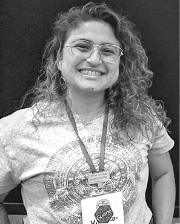

## Hello there! 
(Website in construction)

  

 
I am Viviana Romero Alarcon, a computational biologist from Colombia and a current PhD student at the University of Massachusetts Boston. My primary research is to leverage the power of AI to improve reproducibility and replicability in phylogenetic comparative biology. Also, I am interested in the relation between extinction risk, body mass evolution, and extinction selectivity. I am passionate about modeling, programming, and phylogenies <3 

  

  

  
  

